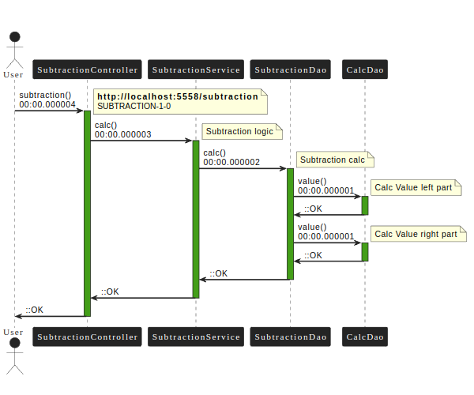
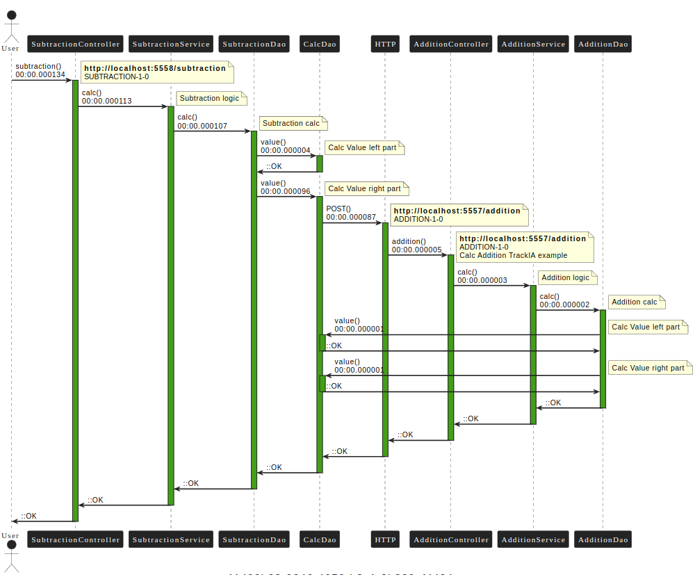

# @Trackia: Ejemplo de calculadora - Subtraction


## Introducción


Este software es parte de un conjunto de ejemplos que demuestran el funcionamiento de la librería @Trackia version 1.1.6.
Para más información puede dirigirse a la página de la librería [www.trackia.app](www.trackia.app) donde encontrará la documentación oficial y otros ejemplos relacionados.


Si bien, es posible ejecutar este servicio de manera autónoma, el ejemplo es aun más ilustrativo si se ejecuta junto a las otras 3 operaciones:
- [addition](https://github.com/trackiaapp/calc-addition)
- [subtraction](https://github.com/trackiaapp/calc-subtraction)
- [multiplication](https://github.com/trackiaapp/calc-multiplication)
- [division](https://github.com/trackiaapp/calc-division)

Por lo que se recomienda bajar las 4 operaciones de la calculadora y ejecutarlos en combinación.


## Arquitectura

Para que este ejemplo sea mas eficiente, es necesario entender la arquitectura de implementada. Este software esta construido en 3 capas:
- Controlador
- Servicio
- Repositorio


## Descripción
Este proyecto permite restar 2 números y devuelve el resultado. Los parámetros de entrada son 2 expresiones que pueden ser:
- Un entero.
- O una expresión que represente otra operación que debe ser evaluada.


## Ejemplos

El siguiente ejemplo da como resultado 8:

**POST**: http://localhost:5558/subtraction

**Body**

```
{
    "left": "10",
    "right": "2"
}
```

Salida:

```
{
    "result": 8,
    "journalId": "cbc36a8c-60c1-4c94-8004-7ad2b306ed26"
}

```
Donde **journalId** es el número de transacción para realizar el seguimiento. Si se consulta el journalId en el E2E de trackia el resultado será el siguiente:





Veamos otro ejemplo. Aquí la resta de 2 números, el primero un 5 y el segundo es el resultado de la suma 3 + 2.
Es importante indicar, que para el completo funcionamiento de la operación deben estar ambos servicios (subtraction y addition) corriendo y configurados correctamente.


**POST**: http://localhost:5558/subtraction

**Body**

```
{    
    "left": "5",
    "right": 
        {

            "operation" : "+",
            "left": "3",
            "right": "2"
         }
}

```

Salida:

```
{
    "result": 0,
    "journalId": "6307b662-116d-491b-81f0-98b197b2bf39"
}

```




## Configuración
El proyecto está configurado con un archivo yml en la ruta: **subtraction/src/main/resources/application.yml** con algunos parámetros por default.


Lo primero que debe considerar es que se ejecuta en localhost en el puerto 5558, si requiere cambiar estos valores, recuerde cambiar los valores de los otros servicios de calculadora relacionados, es decir, se debe cambiar el puerto y/o host en los servicios addition, subtraction, multiplication y division correspondientes.

Otro aspecto importante a considerar, es que la configuración inicial envía la salida hacia el log, si desea cambiar la salida al servicio de trackia, debe crear una cuenta y modificar los valores de "trackia.dispatcher", para más información visite la documentación de dispatcher en
[www.trackia.app/documentacion/dispatcher](www.trackia.app/documentacion/dispatcher)


## Licencia
Proyecto de código abierto, siéntase libre de bajar y modificar este software como estime conveniente.

